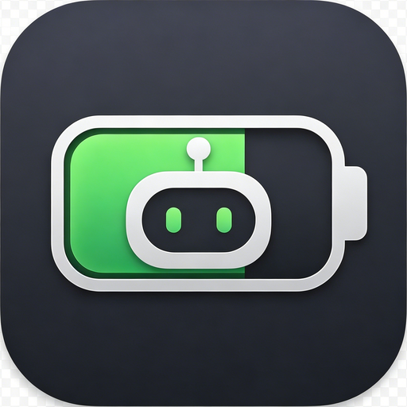
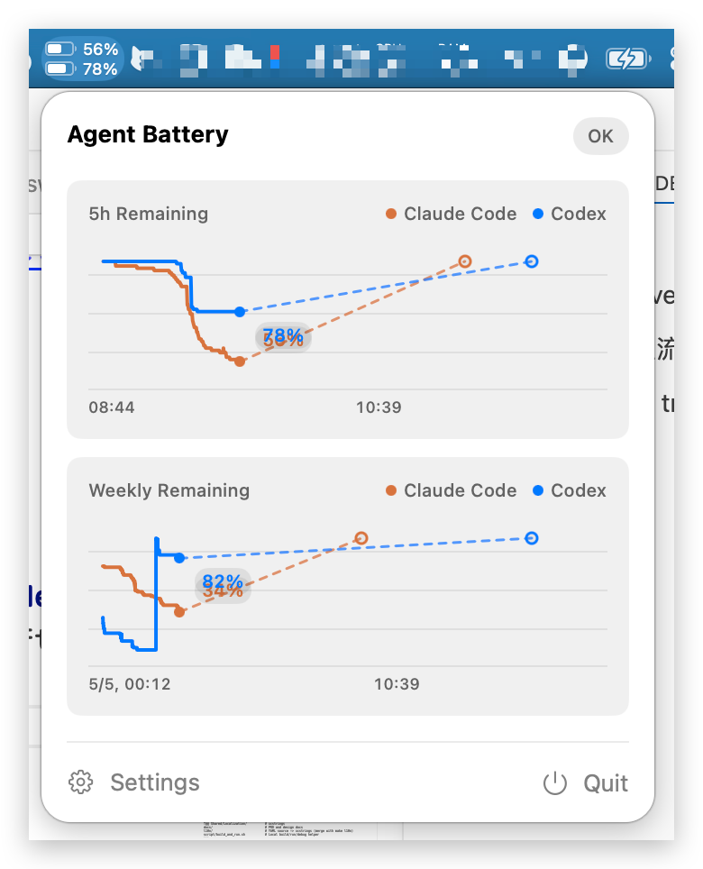
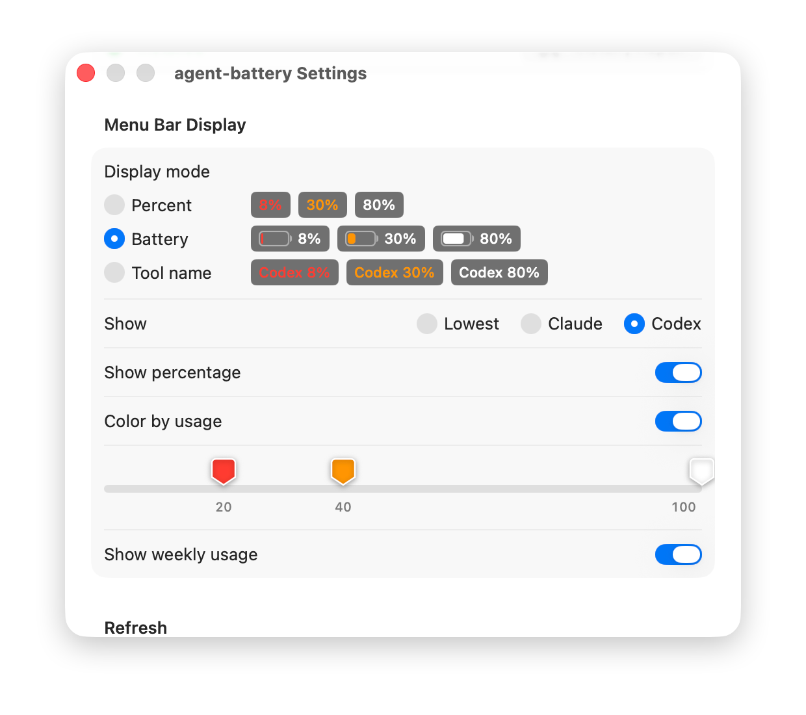

<p align="center">
  
  <br />
</p>

<h1 align="center">Agent Battery</h1>

<p align="center">
  <a href="https://github.com/geebos/agent-battery/releases/latest">
    
  </a>
  <br />
</p>

English | [中文](README.zh.md)

A lightweight macOS menu bar app that displays **Codex** remaining usage as a battery-style percentage and a compact dashboard with daily, weekly, and monthly token usage.

<table>
  <tbody>
    <tr>
      <td></td>
      <td></td>
    </tr>
    <tr>
      <td align="center">Menu bar</td>
      <td align="center">Normal mode</td>
    </tr>
  </tbody>
</table>

## Features

- Persistent menu bar display of Codex remaining 5h quota, with color alerts below thresholds
- Click to open a dashboard with Codex 5h / weekly remaining quota, reset times, and daily / weekly / monthly token usage
- Reads local Codex rollout JSONL directly, with no login, network request, or setup step
- Automatic refresh, configurable to 30 seconds, 1 minute, or 5 minutes
- Configurable launch at login, refresh interval, warning thresholds, and display mode in settings
- Bilingual localization (Chinese and English)

## Installation

### Option 1: Download release build

Download the latest `.dmg` from [Releases](../../releases) and drag it into `Applications`.

> Since the app is not signed/notarized yet, Gatekeeper may block first launch. Go to *System Settings -> Privacy & Security* and click "Open Anyway".

### Option 2: Build from source

Agent Battery runs on macOS 14.0 or later. For source builds, use the current Xcode release.

```bash
git clone https://github.com/<your-name>/agent-battery.git
cd agent-battery
./build.sh app     # Build unsigned Release .app
./build.sh dmg     # Build unsigned universal .dmg
./build.sh open en # Build and open in English
```

Or open `agent-battery.xcodeproj` in Xcode and run the `agent-battery` scheme.

### No Local Xcode: Package with GitHub Actions

If you do not want to install Xcode locally, use the included cloud packaging workflow:

1. Push the repository to GitHub
2. Open the repository **Actions** tab
3. Select **Package macOS App**
4. Click **Run workflow** and enter a version
5. Download the `.dmg` and `.sha256` from **Artifacts** after the job finishes

The artifact is an unsigned, unnotarized universal DMG, so macOS may still require manual approval on first launch.

## First Run

The app **does not proactively connect to any account or API**. It reads usage only from local files:

Codex writes session events to `~/.codex/sessions/`. If rollout JSONL files exist locally, Agent Battery can read them directly with no setup.

## How Data Is Read

The app intentionally avoids network requests and login state. **All usage data comes from local files**.

Codex CLI writes event streams into `~/.codex/sessions/<date>/*.jsonl`, including `event_msg.token_count.rate_limits` and `event_msg.token_count.info.total_token_usage`.

`CodexUsageProvider` strategy:

1. Traverse rollout files by modification time descending (max 80 files)
2. For each file, read **last 1MB in reverse** (`tailChunkBytes`) and find the latest rate-limit event
3. Stop early when later files are older than the already-found event timestamp
4. Parse remaining percentage, reset time, and daily / weekly / monthly token usage into `UsageSnapshot`

This avoids loading huge rollout files in full and requires no Codex configuration.

Related code: `agent-battery/Services/CodexUsageProvider.swift`

### State machine

`CodexUsageProvider` outputs a unified `UsageSnapshot`. In `UsageStore`, app UI is driven by four states: `available / unavailable / stale / error`. Menu bar text/colors and popover hints follow this state model.

## Project structure

```text
agent-battery/
├── agent_batteryApp.swift        # MenuBarExtra entry
├── Models/                       # Data models, including UsageSnapshot
├── Services/                     # Codex usage provider
├── Stores/                       # AppSettings, UsageStore (@Observable)
├── Views/                        # Menu bar, popover, settings
├── Support/                      # Formatters, cache, math utilities
└── Shared/Localization/          # xcstrings
docs/                             # PRD and design docs
l10n/                             # YAML source -> xcstrings (merge with make l10n)
build.sh                          # One-command build entry
script/build_and_run.sh           # Local Debug run/debug helper
script/release_build.sh           # Release .app / .dmg build helper
```

## Development

```bash
./build.sh run        # Debug build and launch
./build.sh logs       # Debug build, launch, and follow logs
./build.sh test       # Run macOS tests
make l10n                             # merge l10n/*.yaml into Localizable.xcstrings
```

## License

MIT
