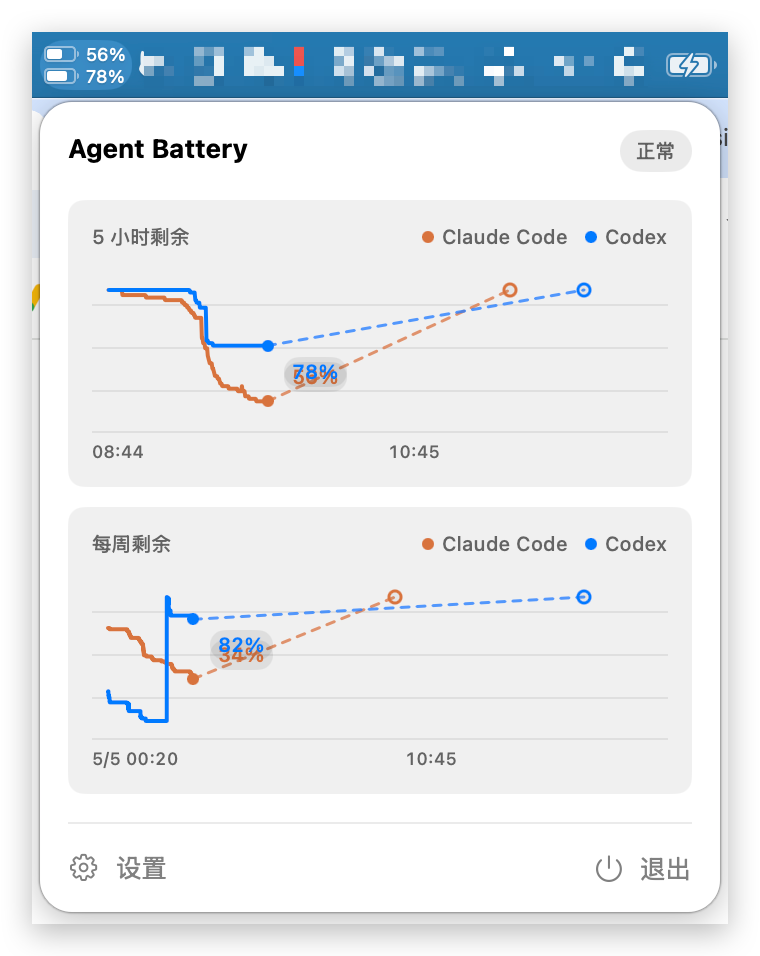
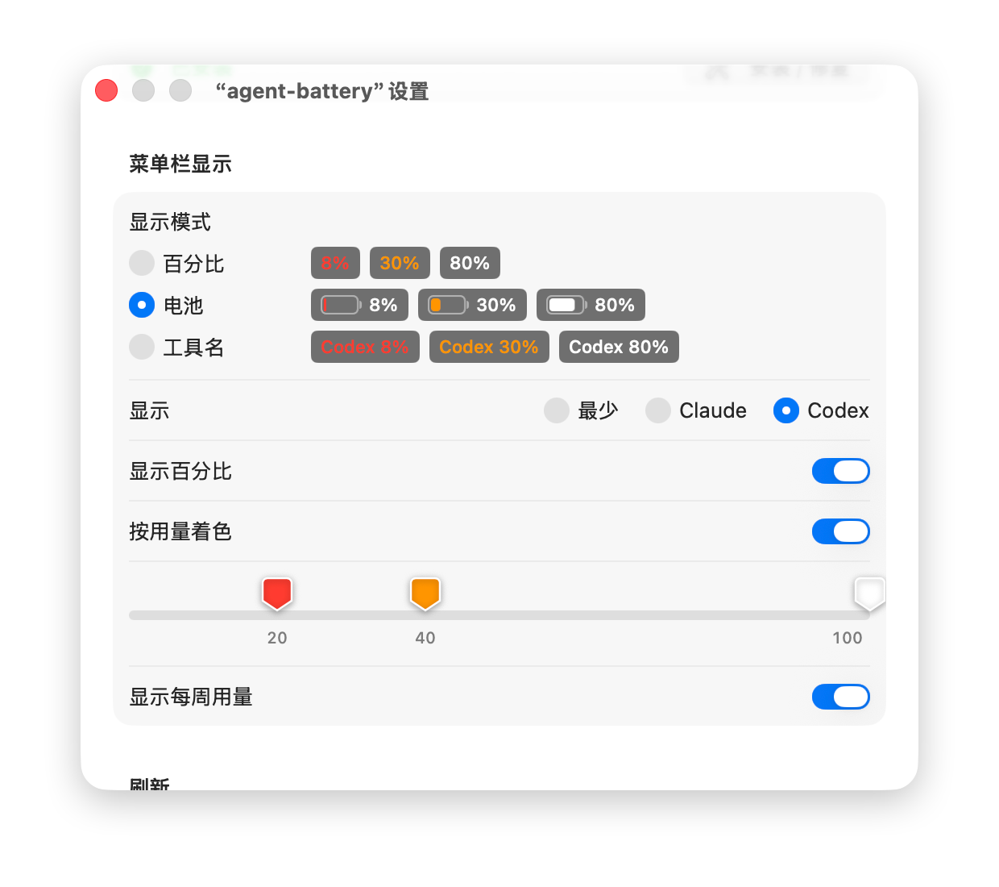

<p align="center">
  
  <br />
</p>

<h1 align="center">Agent Battery</h1>

<p align="center">
  <a href="https://github.com/geebos/agent-battery/releases/latest">
    
  </a>
  <br />
</p>

[English](README.md) | 中文

一个 macOS 状态栏小工具，用「电量百分比」和 dashboard 的形式展示 **Codex** 的 usage 剩余额度，以及今日 / 本周 / 本月 token 用量。

<table>
  <tbody>
    <tr>
      <td></td>
      <td></td>
    </tr>
    <tr>
      <td align="center">菜单栏</td>
      <td align="center">普通模式</td>
    </tr>
  </tbody>
</table>

## 功能

- 状态栏常驻显示 Codex 的 5h 剩余百分比，低于阈值时变色提醒
- 点击展开 dashboard，查看 Codex 的 5h / weekly 剩余额度、重置时间和日 / 周 / 月 token 用量
- 直接读取 Codex 本地 rollout JSONL，无需登录、网络请求或额外 setup
- 自动定时刷新（可调 30 秒 / 1 分钟 / 5 分钟）
- 开机启动、刷新频率、提醒/警告阈值、显示模式等可在设置页配置
- 中英双语本地化

## 安装

### 方式一：下载发布版

到 [Releases](../../releases) 下载最新的 `.dmg`，拖入 `Applications` 即可。

> 由于未签名/未公证，首次启动可能被 Gatekeeper 拦截。在 *系统设置 → 隐私与安全性* 中点击「仍要打开」即可。

### 方式二：源码构建

Agent Battery 运行需要 macOS 14.0 或更高版本。源码构建建议使用当前版本的 Xcode。

```bash
git clone https://github.com/<your-name>/agent-battery.git
cd agent-battery
./build.sh app          # 构建未签名 Release .app
./build.sh dmg          # 构建未签名 universal .dmg
./build.sh open zh-Hans # 构建并以中文打开
```

或直接用 Xcode 打开 `agent-battery.xcodeproj` 运行 `agent-battery` scheme。

### 不装 Xcode：用 GitHub Actions 打包

如果本机不想安装 Xcode，可以用仓库自带的云端打包 workflow：

1. 推送代码到 GitHub
2. 打开仓库页面的 **Actions**
3. 选择 **Package macOS App**
4. 点击 **Run workflow**，填写版本号
5. 等任务完成后，在页面底部 **Artifacts** 下载 `.dmg` 和 `.sha256`

该产物是未签名、未公证的 universal DMG，首次打开仍可能需要在系统安全设置中手动允许。

## 初次使用

应用本身**不会主动连接任何账号或 API**。它通过解析本地数据文件获取 usage：

Codex 会把会话事件写入 `~/.codex/sessions/`。只要本机跑过 Codex 并生成 rollout JSONL，Agent Battery 就能直接读取，无需 setup。

## 读取原理

应用刻意避开网络请求与登录态，**所有 usage 数据都来自本地文件**。

Codex CLI 会把每次会话的事件流写到 `~/.codex/sessions/<日期>/*.jsonl`，其中包含 `event_msg.token_count.rate_limits` 和 `event_msg.token_count.info.total_token_usage`。

`CodexUsageProvider` 的策略：

1. 按修改时间倒序遍历 rollout 文件（最多 80 个）
2. 对每个文件 **从尾部反向读取 1MB**（`tailChunkBytes`），找出最近一次 rate-limit 事件
3. 一旦后续文件的修改时间早于已找到的事件时间就提前停止扫描
4. 解析出剩余百分比、reset 时间，以及日 / 周 / 月 token 用量后输出 `UsageSnapshot`

这样即便 rollout 文件很大也不会全量加载，且无需 Codex 做任何配置。

相关代码：`agent-battery/Services/CodexUsageProvider.swift`

### 状态机

`CodexUsageProvider` 输出统一的 `UsageSnapshot`，应用在 `UsageStore` 中按 `available / unavailable / stale / error` 四种状态驱动 UI。状态栏百分比、配色和弹窗提示都由这套状态决定。

## 项目结构

```
agent-battery/
├── agent_batteryApp.swift        # MenuBarExtra 入口
├── Models/                       # UsageSnapshot 等数据模型
├── Services/                     # Codex 数据源
├── Stores/                       # AppSettings、UsageStore（@Observable）
├── Views/                        # 状态栏、弹窗、设置页
├── Support/                      # 格式化、缓存、数学工具
└── Shared/Localization/          # xcstrings
docs/                             # PRD 与设计文档
l10n/                             # YAML 源 → xcstrings（make l10n 合并）
build.sh                          # 一键构建入口
script/build_and_run.sh           # 本地 Debug 运行/调试
script/release_build.sh           # Release .app / .dmg 构建
```

## 开发

```bash
./build.sh run        # Debug 构建并启动
./build.sh logs       # Debug 构建、启动并跟随日志
./build.sh test       # 运行 macOS 测试
make l10n                             # 把 l10n/*.yaml 合并到 Localizable.xcstrings
```

## License

MIT
